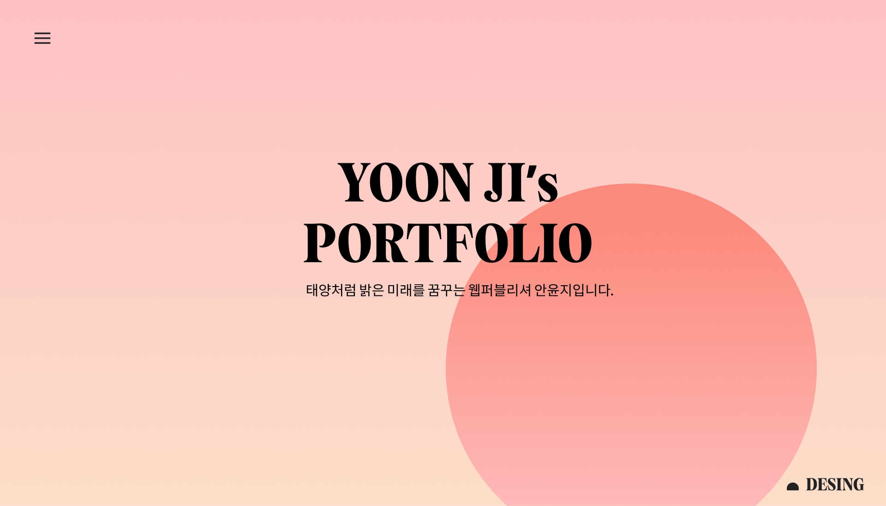
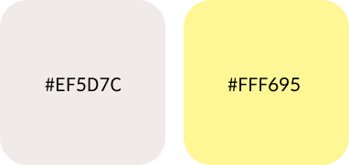
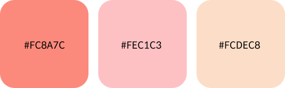

## <h1>🌞Portfolio-작업일지</h1>

# 목표

태양이 떠오르는 느낌을 만들고 보기편한 깔끔한 디자인으로 하는 것이 목표였습니다.

 

# Main Color
  

글의 가독성을 높힐 수 있는 진하지 않은 깔끔한 컬러를 사용하였습니다.

# Sub Color
  

태양을 연상시킬 수 있는 컬러를 linear-gradient로 표현하였습니다.

# Font
  

# Publishing

JavaScript를 활용한 다양한 스크롤 이벤트  

transition을 사용한 자연스러운 움직임  

gsap를 활용한 디자인

Swiper를 적용한 슬라이드

사용기술, 작업물(피그마, 포폴사이트)
